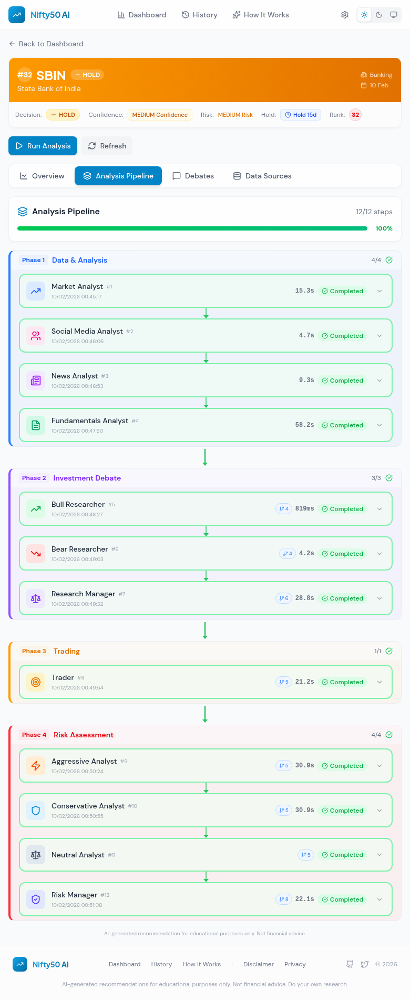
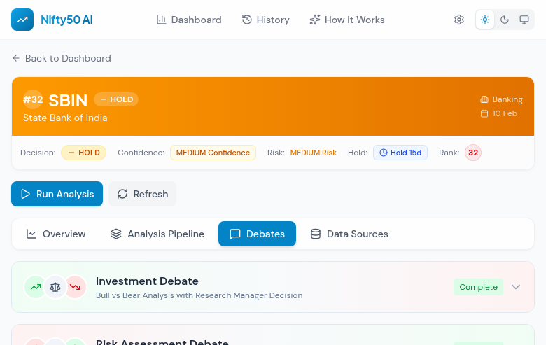
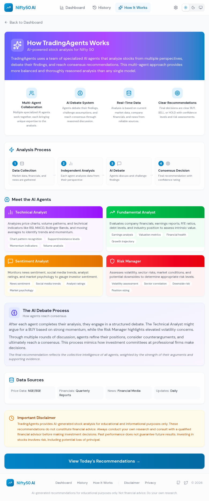

<div align="center">


# TradingAgents

### Multi-Agent LLM Financial Trading Framework

[](https://arxiv.org/abs/2412.20138)
[](https://www.python.org/)
[](LICENSE)
[](https://react.dev/)
[](https://fastapi.tiangolo.com/)
[](https://tailwindcss.com/)

[](https://hjlabs.in)
[](https://github.com/hemangjoshi37a/TradingAgents/stargazers)
[](https://github.com/hemangjoshi37a/TradingAgents/network/members)
[](https://github.com/hemangjoshi37a/TradingAgents/issues)
[](https://github.com/hemangjoshi37a/TradingAgents/commits/main)

<br />

An open-source framework that deploys **specialized AI agents** &mdash; analysts, researchers, traders, and risk managers &mdash; to collaboratively analyze markets and generate investment recommendations through structured debate.

<br />

[Getting Started](#getting-started) &nbsp;&bull;&nbsp; [Web Dashboard](#nifty50-ai-web-dashboard) &nbsp;&bull;&nbsp; [Python API](#python-api) &nbsp;&bull;&nbsp; [Architecture](#architecture) &nbsp;&bull;&nbsp; [Contributing](#contributing) &nbsp;&bull;&nbsp; [hjlabs.in](https://hjlabs.in)

<br />

</div>

---

## Highlights

<table>
<tr>
<td width="50%">

**Multi-Agent Collaboration** &mdash; Specialized AI agents (Technical, Fundamental, Sentiment, Risk) work together, each bringing domain expertise to stock analysis.

**Structured Debate System** &mdash; Bull and bear researchers debate findings, challenge assumptions, and reach consensus through reasoned discussion.

</td>
<td width="50%">

**Real-Time Web Dashboard** &mdash; Production-grade React frontend with live analysis pipeline visualization, backtesting, and portfolio simulation.

**Configurable & Extensible** &mdash; Swap LLM providers (OpenAI, Anthropic Claude), adjust debate rounds, configure data sources, and extend with custom agents.

</td>
</tr>
</table>

---

## Screenshots

<details open>
<summary><b>Dashboard &mdash; AI Recommendations at a Glance</b></summary>
<br />
<p align="center">
  
</p>
</details>

<details>
<summary><b>History &mdash; Backtesting & Portfolio Simulation</b></summary>
<br />
<p align="center">
  
</p>
</details>

<details>
<summary><b>Stock Detail &mdash; Deep Analysis View</b></summary>
<br />
<p align="center">
  
</p>
</details>

<details>
<summary><b>Analysis Pipeline &mdash; 12-Step AI Decision Process</b></summary>
<br />
<p align="center">
  
</p>
</details>

<details>
<summary><b>Investment Debates &mdash; Bull vs Bear AI Agents</b></summary>
<br />
<p align="center">
  
</p>
</details>

<details>
<summary><b>Historical Date View &mdash; Ranked Stock Lists</b></summary>
<br />
<p align="center">
  
</p>
</details>

<details>
<summary><b>How It Works &mdash; Multi-Agent AI System</b></summary>
<br />
<p align="center">
  
</p>
</details>

<details>
<summary><b>Settings &mdash; Configurable AI Models</b></summary>
<br />
<p align="center">
  
</p>
</details>

<details>
<summary><b>Dark Mode</b></summary>
<br />
<p align="center">
  
</p>
</details>

---

## Architecture

TradingAgents mirrors the structure of real-world trading firms by decomposing complex trading tasks into specialized roles:

```
                    +-------------------------------------+
                    |         Data Collection              |
                    |  (Market, News, Social, Financials)  |
                    +-----------------+-------------------+
                                      |
                    +-----------------v-------------------+
                    |          Analyst Team                |
                    |  Technical | Fundamental | Sentiment |
                    |            |  News       |           |
                    +-----------------+-------------------+
                                      |
                    +-----------------v-------------------+
                    |        Researcher Team               |
                    |    Bull Researcher vs Bear Researcher |
                    |      (Structured AI Debate)          |
                    +-----------------+-------------------+
                                      |
                    +-----------------v-------------------+
                    |         Trader Agent                 |
                    |   Synthesizes reports -> Decision    |
                    +-----------------+-------------------+
                                      |
                    +-----------------v-------------------+
                    |    Risk Management & Portfolio Mgr   |
                    |  Evaluates risk -> Approves/Rejects  |
                    +-------------------------------------+
```

<details>
<summary><b>Agent Details</b></summary>

| Agent | Role | Key Capabilities |
|-------|------|------------------|
| **Technical Analyst** | Chart & indicator analysis | RSI, MACD, Bollinger Bands, moving averages, volume patterns |
| **Fundamental Analyst** | Financial evaluation | P/E ratios, earnings, debt analysis, intrinsic value |
| **Sentiment Analyst** | Market mood assessment | Social media trends, analyst ratings, market psychology |
| **News Analyst** | Event impact analysis | Macro indicators, breaking news, sector developments |
| **Bull Researcher** | Bullish case builder | Identifies growth catalysts, upside potential |
| **Bear Researcher** | Risk challenger | Highlights risks, valuation concerns, downside scenarios |
| **Trader Agent** | Decision synthesis | Combines all reports into actionable BUY/SELL/HOLD |
| **Risk Manager** | Portfolio protection | Volatility assessment, position sizing, drawdown limits |

</details>

---

## Getting Started

### Prerequisites

- Python 3.13+
- Node.js 18+ (for web dashboard)
- API keys: OpenAI or Anthropic Claude, [Alpha Vantage](https://www.alphavantage.co/support/#api-key) (free)

### Installation

```bash
# Clone the repository
git clone https://github.com/hemangjoshi37a/TradingAgents.git
cd TradingAgents

# Create virtual environment
conda create -n tradingagents python=3.13
conda activate tradingagents

# Install dependencies
pip install -r requirements.txt
```

### API Keys

```bash
export OPENAI_API_KEY=your_openai_key
export ALPHA_VANTAGE_API_KEY=your_alpha_vantage_key
```

Or create a `.env` file from the template:
```bash
cp .env.example .env
```

> **Note:** Alpha Vantage provides a free API key with 60 requests/minute for TradingAgents-sourced requests. For offline experimentation, a local data vendor option is also available.

### CLI Usage

```bash
python -m cli.main
```

Select your tickers, date, LLMs, and research depth from the interactive interface.

<p align="center">
  
</p>

---

## Nifty50 AI Web Dashboard

A production-grade web dashboard built for **Indian Nifty 50 stocks** with full transparency into the multi-agent decision process.

### Quick Start

```bash
# Terminal 1: Start the backend
cd frontend/backend
pip install -r requirements.txt
python server.py  # http://localhost:8001

# Terminal 2: Start the frontend
cd frontend
npm install
npm run dev  # http://localhost:5173
```

### Features

| Feature | Description |
|---------|-------------|
| **AI Recommendations** | BUY/SELL/HOLD decisions for all 50 Nifty stocks with confidence levels and risk ratings |
| **Stock Ranking (1-50)** | Composite scoring algorithm ranks stocks from best to worst investment opportunity |
| **Analysis Pipeline** | 12-step visualization showing data collection, agent analysis, debate, and decision |
| **Investment Debates** | Full bull vs bear debate transcripts with research manager synthesis |
| **Backtesting** | Prediction accuracy tracking, risk metrics (Sharpe, drawdown), win/loss ratios, date backtest runner with cancel support |
| **Portfolio Simulator** | Paper trading simulation with Zerodha-accurate brokerage charges and Nifty50 benchmarking |
| **Settings Panel** | Configure LLM provider (Claude/OpenAI), model tiers, debate rounds, parallel workers |
| **Dark Mode** | Automatic system theme detection with manual toggle |

### Tech Stack

| Layer | Technology |
|-------|-----------|
| Frontend | React 18 + TypeScript, Vite, Tailwind CSS 4 |
| Charts | Recharts |
| Icons | Lucide React |
| Backend | FastAPI (Python) |
| Database | SQLite |
| Fonts | DM Sans + Plus Jakarta Sans |

### Project Structure

```
frontend/
├── src/
│   ├── components/          # Reusable UI components
│   │   ├── pipeline/        # Analysis pipeline visualization
│   │   ├── StockCard.tsx    # Stock cards with rank badges
│   │   ├── TopPicks.tsx     # Top picks & stocks to avoid
│   │   └── Header.tsx       # Navigation header
│   ├── contexts/            # React contexts (Settings, Theme)
│   ├── pages/
│   │   ├── Dashboard.tsx    # Main stock grid with filters
│   │   ├── StockDetail.tsx  # Individual stock analysis
│   │   ├── History.tsx      # Backtesting & portfolio sim
│   │   └── About.tsx        # How it works
│   ├── services/api.ts      # API client
│   └── types/index.ts       # TypeScript type definitions
├── backend/
│   ├── server.py            # FastAPI server
│   ├── database.py          # SQLite operations & ranking
│   └── backtest_service.py  # Backtesting engine
└── docs/screenshots/        # Documentation screenshots
```

---

## Python API

Use TradingAgents programmatically in your own projects:

```python
from tradingagents.graph.trading_graph import TradingAgentsGraph
from tradingagents.default_config import DEFAULT_CONFIG

ta = TradingAgentsGraph(debug=True, config=DEFAULT_CONFIG.copy())

# Analyze a stock
_, decision = ta.propagate("NVDA", "2024-05-10")
print(decision)
```

### Custom Configuration

```python
from tradingagents.graph.trading_graph import TradingAgentsGraph
from tradingagents.default_config import DEFAULT_CONFIG

config = DEFAULT_CONFIG.copy()
config["deep_think_llm"] = "gpt-4.1-nano"
config["quick_think_llm"] = "gpt-4.1-nano"
config["max_debate_rounds"] = 3

config["data_vendors"] = {
    "core_stock_apis": "yfinance",
    "technical_indicators": "yfinance",
    "fundamental_data": "alpha_vantage",
    "news_data": "alpha_vantage",
}

ta = TradingAgentsGraph(debug=True, config=config)
_, decision = ta.propagate("NVDA", "2024-05-10")
```

See `tradingagents/default_config.py` for the full list of configuration options.

---

## Contributing

We welcome contributions! Whether it's fixing a bug, improving documentation, or suggesting a new feature &mdash; your input helps make this project better.

1. Fork the repository
2. Create a feature branch (`git checkout -b feature/your-feature`)
3. Commit your changes
4. Push to the branch and open a Pull Request

---

## Disclaimer

TradingAgents is designed for **research and educational purposes only**. Trading performance varies based on LLM selection, model temperature, data quality, and other non-deterministic factors. This software is **not financial, investment, or trading advice**. Always do your own research and consult a qualified financial advisor.

---

## Citation

If you find TradingAgents useful in your research, please cite:

```bibtex
@misc{xiao2025tradingagentsmultiagentsllmfinancial,
      title={TradingAgents: Multi-Agents LLM Financial Trading Framework},
      author={Yijia Xiao and Edward Sun and Di Luo and Wei Wang},
      year={2025},
      eprint={2412.20138},
      archivePrefix={arXiv},
      primaryClass={q-fin.TR},
      url={https://arxiv.org/abs/2412.20138},
}
```

---

<div align="center">

### Built and maintained by **[hjlabs.in](https://hjlabs.in)**

[](https://hjlabs.in)
[](https://github.com/hemangjoshi37a)
[](https://www.linkedin.com/in/hemang-joshi/)
[](https://www.youtube.com/@hjlabs)

<sub>Made with AI agents that actually debate before deciding.</sub>

If you find this project useful, please consider giving it a star on GitHub!

</div>
