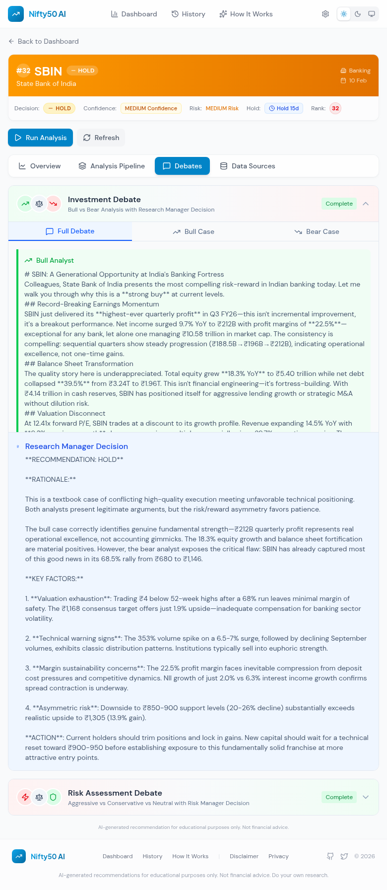

# Nifty50 AI Trading Dashboard

A modern, feature-rich frontend for the TradingAgents multi-agent AI stock analysis system. This dashboard provides real-time AI-powered recommendations for all 50 stocks in the Nifty 50 index, with full visibility into the analysis pipeline, agent reports, and debate processes.

## Features Overview

### Dashboard - Main View
The main dashboard displays AI recommendations for all 50 Nifty stocks with:
- **Summary Statistics**: Quick view of Buy/Hold/Sell distribution
- **Top Picks**: Highlighted stocks with the strongest buy signals
- **Stocks to Avoid**: High-confidence sell recommendations
- **Analyze All**: One-click bulk analysis of all stocks
- **Filter & Search**: Filter by recommendation type or search by symbol


### Dark Mode Support
Full dark mode support with automatic system theme detection:


### Settings Panel
Configure the AI analysis system directly from the browser:
- **LLM Provider Selection**: Choose between Claude Subscription or Anthropic API
- **API Key Management**: Securely store API keys in browser localStorage
- **Model Selection**: Configure Deep Think (Opus) and Quick Think (Sonnet/Haiku) models
- **Analysis Settings**: Adjust max debate rounds for thoroughness vs speed


### Stock Detail View
Detailed analysis view for individual stocks with:
- **Price Chart**: Interactive price history with buy/sell/hold signal markers
- **Recommendation Details**: Decision, confidence level, and risk assessment
- **Recommendation History**: Historical AI decisions for the stock
- **AI Analysis Summary**: Expandable detailed analysis sections


### Analysis Pipeline Visualization
See exactly how the AI reached its decision with the full analysis pipeline:
- **9-Step Pipeline**: Track progress through data collection, analysis, debates, and final decision
- **Agent Reports**: View individual reports from Market, News, Social Media, and Fundamentals analysts
- **Real-time Status**: See which steps are completed, running, or pending


### Investment Debates
The AI uses a debate system where Bull and Bear analysts argue their cases:
- **Bull vs Bear**: Opposing viewpoints with detailed arguments
- **Research Manager Decision**: Final judgment weighing both sides
- **Full Debate History**: Complete transcript of the debate rounds


#### Expanded Debate View
Full debate content with Bull and Bear arguments:



### Data Sources Tracking
View all raw data sources used for analysis:
- **Source Types**: Market data, news, fundamentals, social media
- **Fetch Status**: Success/failure indicators for each data source
- **Data Preview**: Expandable view of fetched data


### How It Works Page
Educational content explaining the multi-agent AI system:
- **Multi-Agent Architecture**: Overview of the specialized AI agents
- **Analysis Process**: Step-by-step breakdown of the pipeline
- **Agent Profiles**: Details about each analyst type
- **Debate Process**: Explanation of how consensus is reached


### Historical Analysis & Backtesting
Track AI performance over time with comprehensive analytics:
- **Prediction Accuracy**: Overall and per-recommendation-type accuracy
- **Accuracy Trend**: Visualize accuracy over time
- **Risk Metrics**: Sharpe ratio, max drawdown, win rate
- **Portfolio Simulator**: Test different investment amounts with Zerodha-accurate brokerage charges
- **AI vs Nifty50**: Compare AI strategy performance against the index
- **Return Distribution**: Histogram of hold-period returns
- **Date Backtest Runner**: Run AI analysis for any date directly from the History page
- **Cancel Support**: Cancel in-progress bulk analysis


#### Date Selection & Stock List
Select any date to view all 50 ranked stocks with decisions, hold periods, and returns:


## Tech Stack

- **Frontend**: React 18 + TypeScript + Vite
- **Styling**: Tailwind CSS with dark mode support
- **Charts**: Recharts for interactive visualizations
- **Icons**: Lucide React
- **State Management**: React Context API
- **Backend**: FastAPI (Python) with SQLite database

## Getting Started

### Prerequisites
- Node.js 18+
- Python 3.10+
- npm or yarn

### Installation

1. **Install frontend dependencies:**
```bash
cd frontend
npm install
```

2. **Install backend dependencies:**
```bash
cd frontend/backend
pip install -r requirements.txt
```

### Running the Application

1. **Start the backend server:**
```bash
cd frontend/backend
python server.py
```
The backend runs on `http://localhost:8001`

2. **Start the frontend development server:**
```bash
cd frontend
npm run dev
```
The frontend runs on `http://localhost:5173`

## Project Structure

```
frontend/
├── src/
│   ├── components/
│   │   ├── pipeline/          # Pipeline visualization components
│   │   │   ├── PipelineOverview.tsx
│   │   │   ├── AgentReportCard.tsx
│   │   │   ├── DebateViewer.tsx
│   │   │   ├── RiskDebateViewer.tsx
│   │   │   └── DataSourcesPanel.tsx
│   │   ├── Header.tsx
│   │   ├── SettingsModal.tsx
│   │   └── ...
│   ├── contexts/
│   │   └── SettingsContext.tsx  # Settings state management
│   ├── pages/
│   │   ├── Dashboard.tsx
│   │   ├── StockDetail.tsx
│   │   ├── History.tsx
│   │   └── About.tsx
│   ├── services/
│   │   └── api.ts              # API client
│   ├── types/
│   │   └── pipeline.ts         # TypeScript types for pipeline data
│   └── App.tsx
├── backend/
│   ├── server.py               # FastAPI server
│   ├── database.py             # SQLite database operations
│   └── recommendations.db      # SQLite database
└── docs/
    └── screenshots/            # Feature screenshots
```

## API Endpoints

### Recommendations
- `GET /recommendations/{date}` - Get all recommendations for a date
- `GET /recommendations/{date}/{symbol}` - Get recommendation for a specific stock
- `POST /recommendations` - Save new recommendations

### Pipeline Data
- `GET /recommendations/{date}/{symbol}/pipeline` - Get full pipeline data
- `GET /recommendations/{date}/{symbol}/agents` - Get agent reports
- `GET /recommendations/{date}/{symbol}/debates` - Get debate history
- `GET /recommendations/{date}/{symbol}/data-sources` - Get data source logs

### Analysis
- `POST /analyze/{symbol}` - Run analysis for a single stock
- `POST /analyze-bulk` - Run analysis for multiple stocks

## Configuration

Settings are stored in browser localStorage and include:
- `deepThinkModel`: Model for complex analysis (opus/sonnet/haiku)
- `quickThinkModel`: Model for fast operations (opus/sonnet/haiku)
- `provider`: LLM provider (claude_subscription/anthropic_api)
- `anthropicApiKey`: API key for Anthropic API provider
- `maxDebateRounds`: Number of debate rounds (1-5)

## Contributing

1. Fork the repository
2. Create a feature branch
3. Make your changes
4. Run tests and linting
5. Submit a pull request

## License

This project is part of the TradingAgents research project.

## Disclaimer

AI-generated recommendations are for educational and informational purposes only. These do not constitute financial advice. Always conduct your own research and consult with a qualified financial advisor before making investment decisions.
